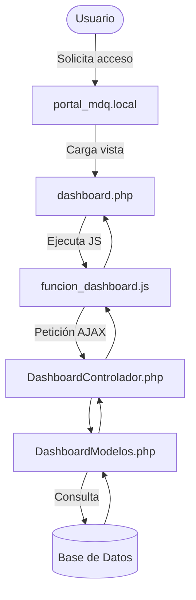

✅ Este código lo pegas en tu `README.md` y se renderiza automáticamente en GitHub.

📎 Puedes usar otros tipos de diagramas también: `sequenceDiagram`, `classDiagram`, `stateDiagram`, etc.

---

### ✅ OPCIÓN 2: Usar una herramienta externa como **https://app.diagrams.net/** (Draw.io)

1. Crea tu diagrama (estructura MVC, peticiones, etc.).
2. **Exporta como imagen (.png o .svg)** o como código `XML`.
3. Guarda la imagen en tu repositorio (por ejemplo en `/docs/diagrama.png`).
4. En el `README.md` o donde quieras, incluyes la imagen:

🏛️ Municipalidad Distrital de Quilmaná
Proyecto desarrollado para mejorar la atención, registro y seguimiento del área de Informática, optimizando los tiempos de respuesta y la trazabilidad de incidencias.

📌 Créditos
Desarrollado por la Unidad de Informática – Municipalidad de Quilmaná
© 2025 – Todos los derechos reservados.