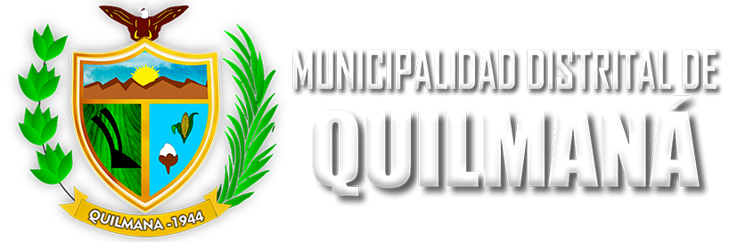
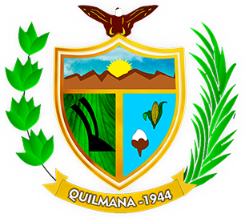

<!-- Escudo principal de la MDQ -->

  

---

#  **Portal MDQ - Help Desk Interno**

---

## 📝 Descripción del Proyecto

El **Portal MDQ** es un sistema de soporte interno (Help Desk) diseñado para gestionar la documentación y el registro de incidencias dentro de la **Unidad de Informática de la Municipalidad Distrital de Quilmaná**. Este sistema permite a los trabajadores registrar problemas técnicos, generar reportes y hacer seguimiento de las soluciones implementadas por el personal técnico.

---

## 🧱 Tecnologías Utilizadas

- **PHP** (Backend)
- **Bootstrap** (Estilos y diseño responsivo)
- **JavaScript** (Funciones de interacción dinámica)
- **AJAX** (Peticiones asincrónicas)
- **MySQL** (Base de datos)
- **Modelo MVC** (Separación de lógica, presentación y datos)

---

## 🧩 ¿Qué es el Modelo MVC?

El **Modelo-Vista-Controlador (MVC)** es un patrón de arquitectura de software que separa la aplicación en tres componentes principales:

- **Modelo (Model):** Gestiona los datos, lógica y reglas de negocio.
- **Vista (View):** Interfaz gráfica del usuario, muestra la información.
- **Controlador (Controller):** Intermediario entre Modelo y Vista, gestiona las peticiones del usuario.

  

---

## ⚙️ Funcionamiento del Sistema

📂 Estructura del Proyecto

Portal_MDQ/
│
├── Config/                          # Configuraciones generales
├── controladores/                  # Controladores MVC
│   ├── dashboard/
│   ├── login/
│   ├── problemas/
│   ├── registro/
│   ├── roles/
│   ├── soportes/
│   ├── subproblemas/
│   ├── trabajadores/
│   ├── LogoutControlador.php
│   └── Plantillacontrolador.php
│
├── modelos/                        # Modelos de datos
│   ├── dashboard/
│   ├── login/
│   ├── problemas/
│   ├── registro/
│   ├── roles/
│   ├── soportes/
│   ├── subproblemas/
│   └── trabajadores/
│
├── vistas/                         # Archivos de presentación (Vistas)
│   ├── assets/
│   │   ├── dist/
│   │   │   ├── css/
│   │   │   └── img/
│   │   │       ├── escudo.png
│   │   │       ├── escudomdq.png
│   │   │       └── ...
│   │   └── js/
│   ├── modulos/
│   │   ├── layout/
│   │   │   ├── footer.php
│   │   │   ├── header_navbar.php
│   │   │   └── sidebar_lateral.php
│   │   ├── dashboard.php
│   │   ├── error404.php
│   │   ├── login.php
│   │   ├── problemas.php
│   │   ├── registro.php
│   │   ├── roles.php
│   │   ├── soportes.php
│   │   ├── subproblemas.php
│   │   └── trabajadores.php
│   └── plantilla.php
│
├── vendor/                         # Librerías externas
├── index.php                       # Entrada principal del sistema
├── composer.json / composer.lock  # Dependencias
├── .htaccess                       # Configuraciones Apache
├── SQL.sql                         # Script de base de datos
└── README.md                       # Documentación
🧠 Lógica Detallada de Peticiones
El usuario ingresa al sistema desde el navegador (portal_mdq.local).

El sistema carga la vista correspondiente (dashboard.php).

JavaScript maneja interacciones dinámicas (funcion_dashboard.js).

Las peticiones se envían mediante AJAX al controlador (DashboardControlador.php).

El controlador procesa y llama al modelo (DashboardModelos.php).

El modelo consulta la base de datos y devuelve datos al controlador.

El controlador responde a la vista para ser mostrada al usuario.

🏛️ Municipalidad Distrital de Quilmaná
Proyecto desarrollado para mejorar la atención, registro y seguimiento del área de Informática, optimizando los tiempos de respuesta y la trazabilidad de incidencias.

📌 Créditos
Desarrollado por la Unidad de Informática – Municipalidad de Quilmaná
© 2025 – Todos los derechos reservados.