✅ Este código lo pegas en tu `README.md` y se renderiza automáticamente en GitHub.

📎 Puedes usar otros tipos de diagramas también: `sequenceDiagram`, `classDiagram`, `stateDiagram`, etc.

---

### ✅ OPCIÓN 2: Usar una herramienta externa como **https://app.diagrams.net/** (Draw.io)

1. Crea tu diagrama (estructura MVC, peticiones, etc.).
2. **Exporta como imagen (.png o .svg)** o como código `XML`.
3. Guarda la imagen en tu repositorio (por ejemplo en `/docs/diagrama.png`).
4. En el `README.md` o donde quieras, incluyes la imagen:

```markdown

```mermaid
flowchart TD
  Usuario([Usuario])
  Usuario -->|Solicita acceso| Dominio[portal_mdq.local]
  Dominio -->|Carga vista| DashboardView[dashboard.php]
  DashboardView -->|Ejecuta JS| JSFunc[funcion_dashboard.js]
  JSFunc -->|Petición AJAX| Controlador[DashboardControlador.php]
  Controlador --> Modelo[DashboardModelos.php]
  Modelo -->|Consulta| BD[(Base de Datos)]
  BD --> Modelo
  Modelo --> Controlador
  Controlador --> JSFunc
  JSFunc --> DashboardView
```




📂 Estructura del Proyecto

Portal_MDQ/
│
├── Config/                          # Configuraciones generales
├── controladores/                  # Controladores MVC
│   ├── dashboard/
│   ├── login/
│   ├── problemas/
│   ├── registro/
│   ├── roles/
│   ├── soportes/
│   ├── subproblemas/
│   ├── trabajadores/
│   ├── LogoutControlador.php
│   └── Plantillacontrolador.php
│
├── modelos/                        # Modelos de datos
│   ├── dashboard/
│   ├── login/
│   ├── problemas/
│   ├── registro/
│   ├── roles/
│   ├── soportes/
│   ├── subproblemas/
│   └── trabajadores/
│
├── vistas/                         # Archivos de presentación (Vistas)
│   ├── assets/
│   │   ├── dist/
│   │   │   ├── css/
│   │   │   └── img/
│   │   │       ├── escudo.png
│   │   │       ├── escudomdq.png
│   │   │       └── ...
│   │   └── js/
│   ├── modulos/
│   │   ├── layout/
│   │   │   ├── footer.php
│   │   │   ├── header_navbar.php
│   │   │   └── sidebar_lateral.php
│   │   ├── dashboard.php
│   │   ├── error404.php
│   │   ├── login.php
│   │   ├── problemas.php
│   │   ├── registro.php
│   │   ├── roles.php
│   │   ├── soportes.php
│   │   ├── subproblemas.php
│   │   └── trabajadores.php
│   └── plantilla.php
│
├── vendor/                         # Librerías externas
├── index.php                       # Entrada principal del sistema
├── composer.json / composer.lock  # Dependencias
├── .htaccess                       # Configuraciones Apache
├── SQL.sql                         # Script de base de datos
└── README.md                       # Documentación
🧠 Lógica Detallada de Peticiones
El usuario ingresa al sistema desde el navegador (portal_mdq.local).

El sistema carga la vista correspondiente (dashboard.php).

JavaScript maneja interacciones dinámicas (funcion_dashboard.js).

Las peticiones se envían mediante AJAX al controlador (DashboardControlador.php).

El controlador procesa y llama al modelo (DashboardModelos.php).

El modelo consulta la base de datos y devuelve datos al controlador.

El controlador responde a la vista para ser mostrada al usuario.

🏛️ Municipalidad Distrital de Quilmaná
Proyecto desarrollado para mejorar la atención, registro y seguimiento del área de Informática, optimizando los tiempos de respuesta y la trazabilidad de incidencias.

📌 Créditos
Desarrollado por la Unidad de Informática – Municipalidad de Quilmaná
© 2025 – Todos los derechos reservados.